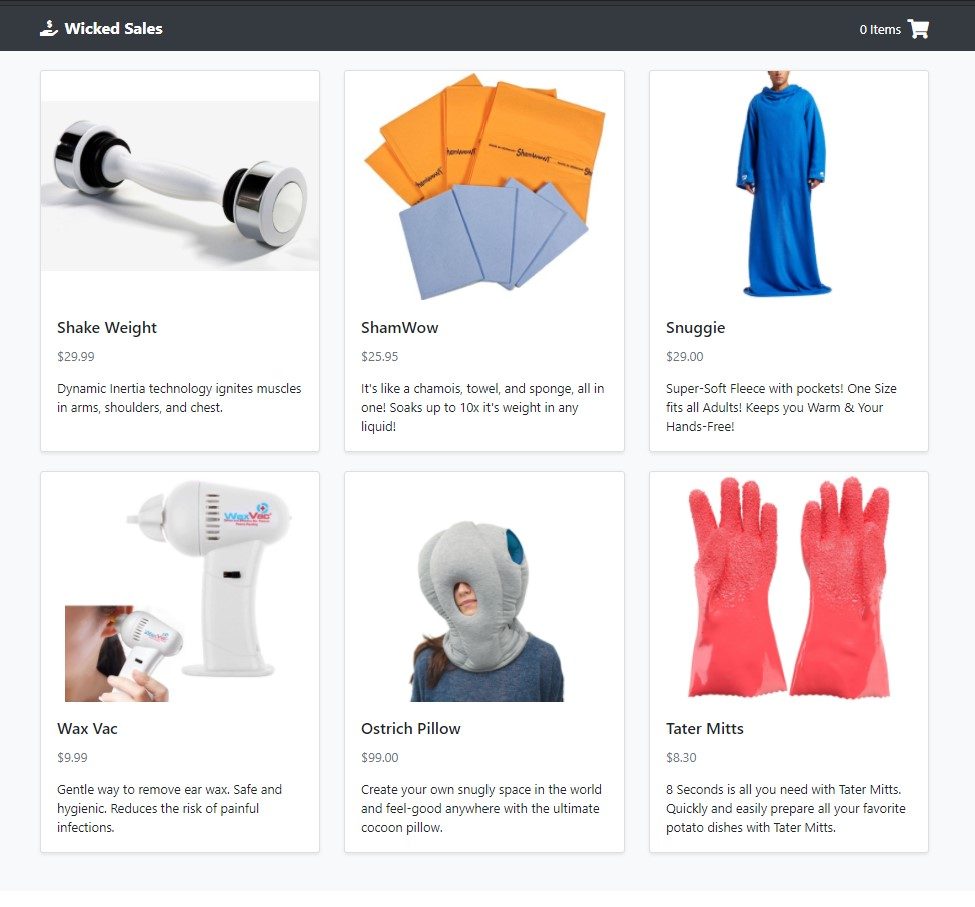

# keycraft
A full stack Node.js and React.js shopping cart application.

## Live Demo

Link to a live demo of the application: 

https://keycraft.felixchin.com/

## Technologies Used

- React.js
- Node.js
- PostgreSQL
- Express
- Webpack 4
- Babel
- Bootstrap 4
- HTML5
- CSS3
- font-awesome
- AWS EC2

## Features

- User can view the products for sale.
- User can view the details of a product.
- User can add a product to their cart.
- User can view their cart summary.
- User can place an order.

## Preview



## Development

### System Requirements

- Node.js 10 or higher
- npm 6 or higher
- PostgreSQL

### Getting Started

1. Clone the repository:
    ```shell
    git clone https://github.com/felix-chin/wicked-sales-js
    cd wicked-sales-js
    ```
2. Install npm dependencies:
    ```shell
    npm install
    ```
3. Start PostgreSQL:

   Command if using Linux:
    ```shell
    sudo service postgresql start
    ```
4. Import the example database to PostgreSQL:
    ```shell
    npm run db:import
    ```
5. Start the application:
    ```shell
    npm run dev
    ```
6. Visit http://localhost:3000 in your browser to view the application.
